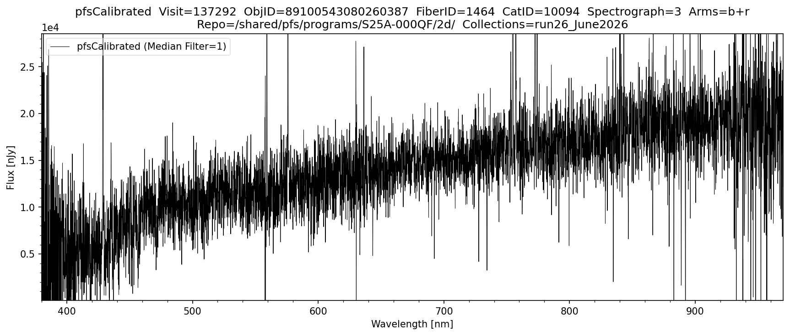

# pfsCalibrated

## Overview

`pfsCalibrated` contains the wavelength-calibrated, sky-subtracted, arm-merged and **flux-calibrated** spectra for all objects in a single visit. The individual spectrum of a single object (i.e. one row/entry inside `pfsCalibrated`) is referred to as a **`pfsSingle`** spectrum. This is the fully reduced pipeline data product for a single exposure (i.e. before co-addition).

- Flux units are **nJy** (nano-Janskys)
- The `WAVELENGTH` is stored in HDU #4 as an image or table (same format as pfsCoadd)

Filename format: `pfsCalibrated_PFS_{visit}_{collection}.fits`

Example from proposal `S25A-000QF`, visit 137292 on the Science Platform:
```
/shared/pfs/programs/S25A-000QF/2d/run26_June2026/pfsCalibrated/20260111/137292/
    pfsCalibrated_PFS_137292_run26_June2026.fits
```

**FITS structure (pfsCoadd format):**

| HDU | Name | Type | Units | Dimensions |
|-----|------|------|-------|------------|
| #0 | PDU | Header | — | — |
| #1 | TARGET | Binary table | — | NOBJECT rows |
| #2 | TARGETFLUX | Binary table | — | NFLUX rows |
| #3 | OBSERVATIONS | Binary table | — | NOBS rows |
| #4 | WAVELENGTH | Image/table | nm (vacuum) | NWAVELENGTH × NOBJECT |
| #5 | FLUX | Image/table | nJy | NWAVELENGTH × NOBJECT |
| #6 | MASK | Image/table | bitmask | NWAVELENGTH × NOBJECT |
| #7 | SKY | Image/table | nJy | NWAVELENGTH × NOBJECT |
| #8 | COVAR | Image/table | nJy² | NWAVELENGTH × NOBJECT × 3 |
| #9 | COVAR2 | Image/table | — | NCOARSE × NCOARSE |
| #10 | METADATA | Binary table | — | NOBJECT rows |
| #11 | FLUXTABLE | Binary table | — | NOBJECT × NOBS × NWAVELENGTH rows |
| #12 | NOTES | Binary table | — | NNOTES rows |

## Viewing pfsCalibrated Spectra

The following plots the `pfsCalibrated` spectrum of a single object from a single visit (exposure). The spectrum is fully reduced and arm-merged, with flux in units of nJy. Instantiate `Butler` by providing the datastore `repo` and `collections`. Specify a `visit` and `objid` to plot that object directly, or use `browse_index` to step through all science objects in a visit sorted by `objId`. The specific arms to be shown can be selected and the spectrum can be smoothed using a median filter if desired.

```python
import numpy as np
import matplotlib.pyplot as plt
from scipy import ndimage
from lsst.daf.butler import Butler
from pfs.datamodel import TargetType

# ==== USER-DEFINED PARAMETERS ====
repo        = "/shared/pfs/programs/S25A-000QF/2d/"  # path to the 2d DRP repository
collections = "run26_June2026"                       # collection name
objid        = 89100543080260387     # If set, plots this object directly. If None uses browse_index
visit        = 137292                # If None, first VISIT containing objid is used automatically
browse_index = 0                     # Used only if objid is None; steps through SCIENCE objects in VISIT by index
MEDIAN_FILTER_SIZE = 1               # 1 = no filtering, increment for smoothing as desired
arms               = ['b', 'r']      # options: 'b', 'r', 'n' or any combination of arms to plot

# ==== PFSCALIBRATED PLOTTING FUNCTION ====
def plot_pfscalibrated(repo, collections, visit, objid, browse_index, MEDIAN_FILTER_SIZE, arms):

    ARM_RANGES = {
        'b': (380,  650),
        'r': (630,  970),
        'n': (940, 1260),
    }

    butler     = Butler(repo, collections=collections)
    all_visits = sorted({ref.dataId['visit'] for ref in butler.registry.queryDatasets('pfsCalibrated')})

    # ==== RESOLVE VISIT AND OBJID ====
    if visit is not None and objid is not None:
        # Both provided — use directly
        pfsConfig = butler.get('pfsConfig', dict(visit=visit))

    elif visit is not None and objid is None:
        # Visit given, select by browse_index
        pfsConfig        = butler.get('pfsConfig', dict(visit=visit))
        pfsConfigScience = pfsConfig.select(targetType=TargetType.SCIENCE, fiberStatus=1)
        all_objids       = sorted(set(int(o) for o in pfsConfigScience.objId))
        objid            = all_objids[browse_index]
        print(f"Browse index {browse_index} of {len(all_objids)-1}  →  objId={objid}")

    elif visit is None and objid is not None:
        # objId given, search all visits
        print(f"Searching {len(all_visits)} visits for objId={objid} ...")
        found_visit = None
        for i, v in enumerate(all_visits):
            print(f"  Checking visit {v} ({i+1}/{len(all_visits)}) ...", end='\r')
            pfsConfig_v = butler.get('pfsConfig', dict(visit=v))
            if (pfsConfig_v.objId == objid).any():
                found_visit = v
                pfsConfig   = pfsConfig_v
                break
        print()
        if found_visit is None:
            raise ValueError(f"objId {objid} not found in any visit in collections '{collections}'")
        visit = found_visit
        print(f"Found objId={objid} in visit={visit}")

    else:
        # Neither provided — use browse_index on first visit
        visit            = all_visits[0]
        pfsConfig        = butler.get('pfsConfig', dict(visit=visit))
        pfsConfigScience = pfsConfig.select(targetType=TargetType.SCIENCE, fiberStatus=1)
        all_objids       = sorted(set(int(o) for o in pfsConfigScience.objId))
        objid            = all_objids[browse_index]
        print(f"Auto-selected visit={visit}  |  Browse index {browse_index} of {len(all_objids)-1}  →  objId={objid}")

    # ==== LOOKUP FIBERID, CATID, SPECTROGRAPH ====
    mask = pfsConfig.objId == objid
    if not mask.any():
        raise ValueError(f"objId {objid} not found in pfsConfig for visit {visit}")

    fiberid      = pfsConfig.fiberId[mask][0]
    catid        = pfsConfig.catId[mask][0]
    spectrograph = pfsConfig.spectrograph[mask][0]
    print(f"ObjId={objid}  Visit={visit}  FiberID={fiberid}  CatID={catid}  Spectrograph={spectrograph}")

    # ==== LOAD DATA ====
    pfsCalibrated = butler.get('pfsCalibrated', visit=visit)
    pfsSingle     = pfsCalibrated[catid, int(objid)]

    # ==== ARM MASK ====
    arm_mask = np.zeros(len(pfsSingle.wavelength), dtype=bool)
    for arm in arms:
        lo, hi = ARM_RANGES[arm]
        arm_mask |= (pfsSingle.wavelength >= lo) & (pfsSingle.wavelength <= hi)

    xlim_lo = min(ARM_RANGES[arm][0] for arm in arms)
    xlim_hi = max(ARM_RANGES[arm][1] for arm in arms)

    # ==== MASK BAD PIXELS ====
    pixels_bad  = (pfsSingle.mask & pfsSingle.flags.get('BAD', 'CR', 'SAT', 'NO_DATA')) != 0
    pixels_good = arm_mask & ~pixels_bad

    # ==== YLIM ====
    flux_in_range = pfsSingle.flux[pixels_good]
    p2, p98       = np.nanpercentile(flux_in_range, [2, 98])
    span          = p98 - p2
    ylim_lower    = p2  - 0.05 * span
    ylim_upper    = p98 + 0.15 * span

    # ==== PLOT ====
    arms_label = '+'.join(arms)
    fig, ax = plt.subplots(figsize=(12, 5))
    fig.subplots_adjust(top=0.88, bottom=0.1, left=0.07, right=0.97)

    ax.plot(pfsSingle.wavelength[pixels_good],
            ndimage.median_filter(pfsSingle.flux[pixels_good], size=MEDIAN_FILTER_SIZE),
            linewidth=0.5, color='black',
            label=f'pfsCalibrated (Median Filter={MEDIAN_FILTER_SIZE})')
    ax.set_xlim([xlim_lo, xlim_hi])
    ax.set_ylim([ylim_lower, ylim_upper])
    ax.ticklabel_format(axis='y', style='sci', scilimits=(0, 0))
    ax.set_title(f'pfsCalibrated  Visit={visit}  ObjID={objid}  FiberID={fiberid}  CatID={catid}  Spectrograph={spectrograph}  Arms={arms_label}\n'
                 f'Repo={repo}  Collections={collections}')
    ax.legend(loc='upper left', fancybox=True, framealpha=0.5)
    ax.minorticks_on()
    ax.set_xlabel('Wavelength [nm]')
    ax.set_ylabel('Flux [nJy]')
    plt.savefig(f'pfsCalibrated_{collections}_{objid}.png', dpi=150, bbox_inches='tight')
    plt.show()

# ==== RUN ====
plot_pfscalibrated(
    repo               = repo,
    collections        = collections,
    visit              = visit,
    objid              = objid,
    browse_index       = browse_index,
    MEDIAN_FILTER_SIZE = MEDIAN_FILTER_SIZE,
    arms               = arms,
)
```

**Output**:


