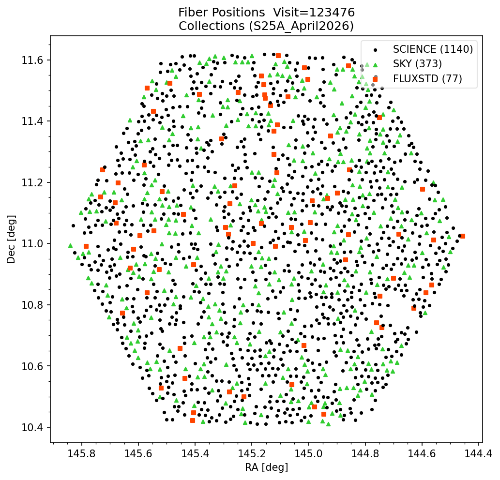

# pfsConfig

## Overview

`pfsConfig` records the *realized* fiber configuration for a specific **visit** (exposure).
It is the observed counterpart to `pfsDesign`, capturing where each fiber
actually ended up on the focal plane (as opposed to where it was intended to be). The pfsConfig files are the primary destination of all object related information, e.g. RA/Dec, catalog ID, target type, fiber status, object fluxes (from public catalogs).

Filename format: `pfsConfig_PFS_{visit}_{collection}.fits`

Example from proposal `S25A-000QF`, visit 123476 on the Science Platform:

```
/shared/pfs/programs/S25A-000QF/2d/S25A_April2026/pfsConfig/20250403/123476/
    pfsConfig_PFS_123476_S25A_April2026.fits
```

**FITS structure:**


| HDU | Name       | Type         | Description                                     |
| --- | ---------- | ------------ | ----------------------------------------------- |
| #0  | PDU        | Header       | Actual telescope boresight RA/Dec (degrees)     |
| #1  | CONFIG     | Binary table | Per-fiber target and position data              |
| #2  | PHOTOMETRY | Binary table | Per-fiber flux measurements in multiple filters |


**CONFIG table columns (key fields):**


| Column        | Type           | Description                                            |
| ------------- | -------------- | ------------------------------------------------------ |
| `fiberId`     | 32-bit int     | Fiber identifier (starts at 1)                         |
| `catId`       | 32-bit int     | Source catalog identifier                              |
| `objId`       | 64-bit int     | Unique object identifier                               |
| `ra`, `dec`   | 64-bit float   | Target position (degrees)                              |
| `targetType`  | 32-bit int     | Target class (e.g. SCIENCE, SKY, FLUXSTD,...)          |
| `fiberStatus` | 32-bit int     | Fiber health (e.g. GOOD, BROKENFIBER, BLOCKED,...)     |
| `pfiNominal`  | 2×32-bit float | Intended fiber position on the focal plane (mm)        |
| `pfiCenter`   | 2×32-bit float | Actual measured fiber position on the focal plane (mm) |
| `proposalId`  | string         | Subaru proposal ID (e.g. `S24B-001QN`)                 |
| `obCode`      | string         | Observing Block code within a proposal                 |


**PHOTOMETRY table columns (key fields):**


| Column       | Units | Description                                                     |
| ------------ | ----- | --------------------------------------------------------------- |
| `fiberFlux`  | nJy   | Flux within ~1 arcsec fiber aperture (seeing-corrected)         |
| `psfFlux`    | nJy   | Flux from PSF fitting to infinite radius                        |
| `totalFlux`  | nJy   | Total flux (PSF for point sources; extended model for galaxies) |
| `filterName` | —     | Filter name specifying the transmission curve                   |


The fluxes above are collected from public catalogs such as HSC SSP, PS1, GAIA.

## Checking all Visits in Collection

Here we show how to set up `Butler` and list all available visits in a `collection`. Simply specify under **USER-DEFINED PARAMETERS** the 2d DRP data repository location and `collection` name:

```python
from lsst.daf.butler import Butler

# ==== USER-DEFINED PARAMETERS ====
repo        = "/shared/pfs/programs/S25A-000QF/2d/"  # path to the 2d DRP repository
collections = "S25A_April2026"                       # collection name

# ==== QUERY ALL VISITS FROM BUTLER AND PRINT ALL VISITS ====
butler      = Butler(repo, collections=collections)
all_visits = sorted({ref.dataId['visit'] for ref in butler.registry.queryDatasets('pfsMerged')})
print(f"Total visits: {len(all_visits)}")
print(f"Visits: {all_visits}")
```

**Output**:

```
Total visits: 632
Visits: [122041, 122042, 122044, 122045, 122047, 122048, 122050, 122051, 122182, 122183, 122185, 122186, 122195, 122196, 122456, 122457, 122459, 122460, 122462, 122463, 122465, 122466, 122468, 122469, 122471, 122472, 122475, 122476, 122478, 122479, 122481, 122482, 122484, 122485, 122487, 122488, 122490, 122491, 122493, 122494, 122496, 122497, 122499, 122500, 122502, 122503, 122506, 122507, 122509, 122510, 122512, 122513, 122515, 122516, 122518, 122519, 122521, 122522, 122524, 122526, 122527, 122529, 122530, 122581, 122582, 122584, 122585, 122587, 122588, 122590, 122591, 122593, 122594, 122596, 122597, 122599, 122600, 122602, 122603, 122605, 122606, 122608, 122609, 122611, 122612, 122614, 122615, 122617, 122618, 122623, 122624, 122626, 122627, 122629, 122630, 122632, 122633, 122637, 122638, 122640, 122641, 122643, 122644, 122647, 122648, 122650, 122651, 122653, 122654, 122733, 122734, 122737, 122738, 122740, 122741, 122743, 122744, 122748, 122749, 122751, 122752, 122754, 122755, 122757, 122758, 122760, 122761, 122763, 122764, 122766, 122767, 122884, 122885, 122887, 122888, 122890, 122891, 122896, 122899, 122901, 122902, 122904, 122905, 122907, 122908, 122910, 122911, 122913, 122914, 122916, 122917, 122919, 122920, 122922, 122923, 123007, 123008, 123010, 123011, 123013, 123014, 123016, 123017, 123019, 123020, 123022, 123023, 123025, 123026, 123028, 123029, 123034, 123035, 123037, 123038, 123040, 123041, 123043, 123044, 123127, 123128, 123130, 123131, 123133, 123134, 123138, 123139, 123141, 123142, 123146, 123147, 123149, 123150, 123152, 123153, 123155, 123156, 123158, 123159, 123161, 123162, 123242, 123243, 123245, 123246, 123248, 123249, 123251, 123252, 123254, 123255, 123260, 123261, 123263, 123264, 123266, 123267, 123269, 123270, 123272, 123273, 123275, 123276, 123278, 123279, 123355, 123356, 123358, 123359, 123361, 123362, 123364, 123365, 123367, 123368, 123372, 123373, 123375, 123376, 123378, 123379, 123381, 123382, 123384, 123385, 123387, 123388, 123390, 123391, 123476, 123477, 123478, 123479, 123481, 123482, 123483, 123484, 123486, 123487, 123488, 123489, 123491, 123492, 123493, 123494, 123496, 123497, 123498, 123499, 123500, 123502, 123503, 123504, 123505, 123507, 123508, 123607, 123608, 123610, 123611, 123613, 123614, 123619, 123620, 123622, 123623, 123625, 123626, 123628, 123629, 123631, 123632, 123634, 123635, 123637, 123638, 123640, 123641, 123643, 123644, 123646, 123647, 123649, 123650, 123652, 123653, 123657, 123658, 123660, 123661, 123665, 123666, 123668, 123669, 123671, 123672, 123675, 123676, 123678, 123679, 123681, 123682, 125884, 125885, 125887, 125888, 125890, 125891, 125893, 125894, 125896, 125897, 125899, 125900, 125902, 125903, 126000, 126001, 126003, 126004, 126006, 126007, 126009, 126010, 126012, 126013, 126015, 126016, 126018, 126019, 126021, 126022, 126024, 126025, 126027, 126028, 126030, 126031, 126109, 126110, 126112, 126113, 126115, 126116, 126118, 126119, 126123, 126124, 126126, 126127, 126129, 126130, 126132, 126133, 126135, 126136, 126138, 126139, 126141, 126142, 126144, 126145, 126147, 126148, 126150, 126151, 126154, 126155, 126157, 126158, 126160, 126161, 126163, 126164, 126166, 126167, 126169, 126170, 126231, 126232, 126234, 126235, 126237, 126238, 126240, 126241, 126243, 126244, 126246, 126247, 126253, 126254, 126256, 126257, 126259, 126260, 126262, 126263, 126265, 126266, 126268, 126269, 126271, 126272, 126274, 126275, 126277, 126278, 126280, 126281, 126283, 126284, 126286, 126287, 126289, 126290, 126292, 126293, 126295, 126296, 126802, 126803, 126805, 126806, 126810, 126811, 126813, 126814, 126816, 126817, 126820, 126821, 126823, 126824, 126826, 126827, 126829, 126830, 126832, 126833, 126835, 126836, 126838, 126839, 126844, 126845, 126847, 126848, 126850, 126851, 126853, 126854, 126856, 126857, 126859, 126860, 126862, 126863, 126865, 126866, 126910, 126911, 126913, 126914, 126918, 126919, 126921, 126922, 126924, 126925, 126927, 126928, 126930, 126931, 126933, 126934, 126941, 126942, 126944, 126945, 126947, 126948, 126950, 126951, 126953, 126954, 127765, 127766, 127768, 127769, 127771, 127772, 127774, 127775, 127777, 127778, 127780, 127781, 127783, 127784, 127786, 127787, 127789, 127790, 127792, 127793, 127894, 127895, 127897, 127898, 127900, 127901, 127903, 127904, 127906, 127907, 127909, 127910, 127912, 127913, 127915, 127916, 127918, 127919, 127921, 127922, 127997, 127998, 128000, 128001, 128003, 128004, 128006, 128007, 128009, 128010, 128012, 128013, 128015, 128016, 128018, 128019, 128023, 128024, 128026, 128027, 128029, 128030, 128032, 128033, 128035, 128036, 128038, 128039, 128041, 128042, 128044, 128045, 128047, 128048, 128050, 128051, 128053, 128054, 128056, 128057, 128114, 128115, 128117, 128118, 128120, 128121, 128123, 128124, 128126, 128127, 128129, 128130, 128132, 128133, 128282, 128283, 128285, 128286, 128288, 128289, 128291, 128292, 128294, 128295, 128297, 128298, 128300, 128301, 128444, 128445, 128447, 128448, 128450, 128451, 128453, 128454, 128456, 128457, 128459, 128460, 128462, 128463, 128465, 128467, 128469, 128470]
```


## Viewing Fiber Distribution in a Visit

The following code shows the distribution of all fibers (SCIENCE, SKY, FLUX STANDARDS) on the focal plane for a given visit. As before, specify the 2d DRP data repository location and `collection` name, along with the visit number (or increment through visits in the `collection` using a simple index):

```python
import numpy as np
import matplotlib.pyplot as plt
from lsst.daf.butler import Butler
from pfs.datamodel import TargetType

# ==== USER-DEFINED PARAMETERS ====
repo        = "/shared/pfs/programs/S25A-000QF/2d/"  # path to the 2d DRP repository
collections = "S25A_April2026"                       # collection name
VISIT       = 123476 # Inspects and plots fiber positions in specified visit
VISIT_INDEX = 0      # Used if VISIT is None. Increment through visits in collections (0 = first, 1 = second, etc.)

# ==== QUERY ALL FULLY-PROCESSED VISITS FROM BUTLER ====
butler     = Butler(repo, collections=collections)
all_visits = sorted({ref.dataId['visit'] for ref in butler.registry.queryDatasets('pfsMerged')})
print(f"Total visits in Collections ({collections}): {len(all_visits)}")

if VISIT is not None:
    if VISIT not in all_visits:
        raise ValueError(f"Visit {VISIT} not found in collections '{collections}'")
    visit = VISIT
    print(f"Using specified visit={visit}")
else:
    visit = all_visits[VISIT_INDEX]
    print(f"Selected visit index {VISIT_INDEX}: visit={visit}")

# ==== LOAD FIBER CONFIGURATION FOR THE SELECTED VISIT ====
pfsConfig = butler.get('pfsConfig', dict(visit=visit))
sci       = pfsConfig.select(targetType=TargetType.SCIENCE,  fiberStatus=1)
sky       = pfsConfig.select(targetType=TargetType.SKY,      fiberStatus=1)
fluxstd   = pfsConfig.select(targetType=TargetType.FLUXSTD,  fiberStatus=1)

# ==== PLOT RA/DEC POSITIONS OF ALL FIBER TYPES FOR THE SELECTED VISIT ====
fig, ax = plt.subplots(figsize=(7, 7))
fig.subplots_adjust(top=0.90, bottom=0.10, left=0.12, right=0.97)

ax.scatter(sci.ra,     sci.dec,     s=6,  marker='o', color='black',    label=f'SCIENCE ({len(sci.ra)})',      zorder=3)
ax.scatter(sky.ra,     sky.dec,     s=12, marker='^', color='limegreen', label=f'SKY ({len(sky.ra)})',          zorder=2)
ax.scatter(fluxstd.ra, fluxstd.dec, s=12, marker='s', color='orangered', label=f'FLUXSTD ({len(fluxstd.ra)})', zorder=2)

ax.set_xlabel('RA [deg]')
ax.set_ylabel('Dec [deg]')
ax.set_title(f'Fiber Positions  Visit={visit}\nCollections ({collections})')
ax.legend(loc='upper right', fancybox=True, framealpha=0.5)
ax.invert_xaxis()
ax.minorticks_on()
plt.show()
```

**Output**:

```
Total visits in Collections (S25A_April2026): 632
Using specified visit=123476
```



## List all Visits (Exposures) for an Object

If you have the `objId` of a specific object you have observed, the following code prints a summary of all visits that contain that object, including its catalog ID and magnitude.

```python
import numpy as np
from astropy.io import fits
from lsst.daf.butler import Butler
from pfs.datamodel import TargetType

# ==== USER-DEFINED PARAMETERS ====
repo        = "/shared/pfs/programs/S25A-000QF/2d/"  # path to the 2d DRP repository
collections = "S25A_April2026"                       # collection name
objid       = 120731449862702300

# ==== GET ALL PFSCONFIG FILE REFERENCES FROM BUTLER ====
butler   = Butler(repo, collections=collections)
all_refs = list(butler.registry.queryDatasets('pfsConfig'))

# ==== SCAN ALL PFSCONFIG FILES TO FIND WHICH VISITS CONTAIN THE OBJECT ====
objid_visits = []
info_ref     = None

for ref in all_refs:
    uri = butler.getURI(ref)
    with fits.open(uri.path) as hdul:
        objids = hdul[1].data['objId']
        if objid in objids:
            objid_visits.append(ref.dataId['visit'])
            if info_ref is None:
                info_ref = ref

if not objid_visits:
    raise ValueError(f"objId {objid} not found in any pfsConfig in collections '{collections}'")

objid_visits = sorted(set(objid_visits))
print(f"ObjId={objid} found in {len(objid_visits)} visit(s): {objid_visits}")

# ==== LOAD OBJECT DETAILS FROM THE FIRST MATCHING VISIT ====
pfsConfig    = butler.get('pfsConfig', dict(visit=objid_visits[0]))
sci          = pfsConfig.select(targetType=TargetType.SCIENCE, fiberStatus=1)
sci_mask     = sci.objId == objid
idx          = np.where(sci_mask)[0][0]
filter_names = list(sci.filterNames[0])
first_filter = filter_names[0]
total_flux   = np.array([list(f) for f in sci.totalFlux], dtype=float)
psf_flux     = np.array([list(f) for f in sci.psfFlux],   dtype=float)
flux         = np.where((total_flux > 0) & np.isfinite(total_flux), total_flux, psf_flux)
with np.errstate(divide='ignore', invalid='ignore'):
    mag = np.where(flux > 0, -2.5 * np.log10(flux) + 31.4, np.nan)

print(f"\nObject info (from visit {objid_visits[0]}):")
print(f"  ObjId        = {int(sci.objId[idx])}")
print(f"  CatId        = {int(sci.catId[idx])}")
print(f"  Spectrograph = {int(sci.spectrograph[idx])}")
print(f"  Mag ({first_filter}) = {mag[idx, 0]:.3f} AB")
```

**Output**:

```
ObjId=120731449862702300 found in 4 visit(s): [123476, 123477, 123478, 123479]

Object info (from visit 123476):
  ObjId        = 120731449862702300
  CatId        = 10094
  Spectrograph = 3
  Mag (g_ps1) = 21.635 AB
```

