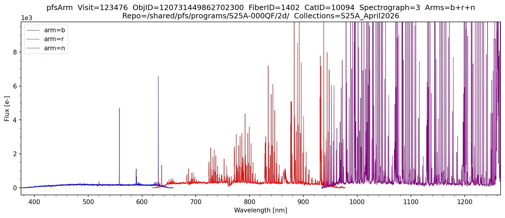

# pfsArm

## Overview

`pfsArm` contains the **wavelength-calibrated, sky-subtracted**, but **not flux-calibrated** spectra of all fibers in a single spectrograph arm from a single visit (exposure).
Each active arm (`b`=Blue, `r`=Red, `n`=IR, `m`=Medium-resolution red) and each spectrograph module (1–4)
produces a separate file. The wavelength grid is not required to be uniform — a wavelength array is stored per pixel.

- Flux units are **electrons**
- The `WAVELENGTH` array is stored per pixel, per fiber (one array per fiber)

Filename format: `pfsArm_PFS_{visit}_{arm}{spectrograph}_{collection}.fits`

Example from proposal `S25A-000QF`, visit 123476 on the Science Platform (blue `b`, red `r`, and IR `n` arms across 4 spectrograph modules):
```
/shared/pfs/programs/S25A-000QF/2d/S25A_April2026/pfsArm/20250403/123476/
    pfsArm_PFS_123476_b1_S25A_April2026.fits
    pfsArm_PFS_123476_b2_S25A_April2026.fits
    pfsArm_PFS_123476_b3_S25A_April2026.fits
    pfsArm_PFS_123476_b4_S25A_April2026.fits
    pfsArm_PFS_123476_r1_S25A_April2026.fits
    ...
    pfsArm_PFS_123476_n4_S25A_April2026.fits
```

**FITS structure:**

| HDU | Name | Type | Units | Dimensions |
|-----|------|------|-------|------------|
| #0 | PDU | Header | — | — |
| #1 | FIBERID | Image | — | NFIBER |
| #2 | WAVELENGTH | Image | nm (vacuum) | NROW × NFIBER |
| #3 | FLUX | Image | electrons | NROW × NFIBER |
| #4 | MASK | Image | bitmask | NROW × NFIBER |
| #5 | SKY | Image | electrons | NROW × NFIBER |
| #6 | NORM | Image | electrons | NROW × NFIBER |
| #7 | COVAR | Image | — | NROW × 3 × NFIBER |
| #8 | CONFIG | Binary table | — | 1 row (pfsDesignId, visit) |
| #9 | NOTES | Binary table | — | NFIBER rows |

## Viewing pfsArm Spectra

The following plots the `pfsArm` spectrum of a single object from a single visit. Each arm is fetched and plotted individually with its own color. Instantiate `Butler` by providing the datastore `repo` and `collections`. Then specify a `visit` and `objid` to plot that object directly, or use `browse_index` to step through all science objects in a visit sorted by `objId`. The specific arms to be plotted can be selected and the spectra can be smoothed using a median filter if desired.

```python
import numpy as np
import matplotlib.pyplot as plt
from scipy import ndimage
from lsst.daf.butler import Butler
from pfs.datamodel import TargetType

# ==== USER-DEFINED PARAMETERS ====
repo        = "/shared/pfs/programs/S25A-000QF/2d/"  # path to the 2d DRP repository
collections = "S25A_April2026"                       # collection name
objid        = 120731449862702300    # If set, plots this object directly. If None uses browse_index
visit        = 123476                # If None, first VISIT containing objid is used automatically
browse_index = 0                     # Used only if objid is None; steps through SCIENCE objects in VISIT by index
MEDIAN_FILTER_SIZE = 1               # 1 = no filtering, increment for smoothing as desired
arms               = ['b', 'r', 'n'] # options: 'b', 'r', 'm', 'n' or any combination

# ==== PFSARM PLOTTING FUNCTION ====
def plot_pfsarm(repo, collections, visit, objid, browse_index, MEDIAN_FILTER_SIZE, arms):

    ARM_COLORS = {
        'b': 'blue',
        'r': 'red',
        'm': 'darkred',
        'n': 'purple',
    }

    butler     = Butler(repo, collections=collections)
    all_visits = sorted({ref.dataId['visit'] for ref in butler.registry.queryDatasets('pfsArm')})

    # ==== RESOLVE VISIT AND OBJID ====
    if visit is not None and objid is not None:
        # Both provided — use directly
        pfsConfig = butler.get('pfsConfig', dict(visit=visit))

    elif visit is not None and objid is None:
        # Visit given, select by browse_index
        pfsConfig        = butler.get('pfsConfig', dict(visit=visit))
        pfsConfigScience = pfsConfig.select(targetType=TargetType.SCIENCE, fiberStatus=1)
        all_objids       = sorted(set(int(o) for o in pfsConfigScience.objId))
        objid            = all_objids[browse_index]
        print(f"Browse index {browse_index} of {len(all_objids)-1}  →  objId={objid}")

    elif visit is None and objid is not None:
        # objId given, search all visits
        print(f"Searching {len(all_visits)} visits for objId={objid} ...")
        found_visit = None
        for i, v in enumerate(all_visits):
            print(f"  Checking visit {v} ({i+1}/{len(all_visits)}) ...", end='\r')
            pfsConfig_v = butler.get('pfsConfig', dict(visit=v))
            if (pfsConfig_v.objId == objid).any():
                found_visit = v
                pfsConfig   = pfsConfig_v
                break
        print()
        if found_visit is None:
            raise ValueError(f"objId {objid} not found in any visit in collections '{collections}'")
        visit = found_visit
        print(f"Found objId={objid} in visit={visit}")

    else:
        # Neither provided — use browse_index on first visit
        visit            = all_visits[0]
        pfsConfig        = butler.get('pfsConfig', dict(visit=visit))
        pfsConfigScience = pfsConfig.select(targetType=TargetType.SCIENCE, fiberStatus=1)
        all_objids       = sorted(set(int(o) for o in pfsConfigScience.objId))
        objid            = all_objids[browse_index]
        print(f"Auto-selected visit={visit}  |  Browse index {browse_index} of {len(all_objids)-1}  →  objId={objid}")

    # ==== LOOKUP FIBERID, CATID, SPECTROGRAPH ====
    mask = pfsConfig.objId == objid
    if not mask.any():
        raise ValueError(f"objId {objid} not found in pfsConfig for visit {visit}")

    fiberid      = pfsConfig.fiberId[mask][0]
    catid        = pfsConfig.catId[mask][0]
    spectrograph = pfsConfig.spectrograph[mask][0]
    print(f"ObjId={objid}  Visit={visit}  FiberID={fiberid}  CatID={catid}  Spectrograph={spectrograph}")

    # ==== FETCH AND PLOT ARMS ====
    fig, ax = plt.subplots(figsize=(12, 5))
    fig.subplots_adjust(top=0.88, bottom=0.1, left=0.07, right=0.97)

    all_flux        = []
    all_wavelengths = []
    plotted_arms    = []

    for arm in arms:
        plot_arm = arm
        try:
            pfsArm = butler.get('pfsArm', visit=visit, arm=arm, spectrograph=spectrograph).select(fiberId=fiberid)
        except Exception:
            if arm == 'r':
                try:
                    pfsArm   = butler.get('pfsArm', visit=visit, arm='m', spectrograph=spectrograph).select(fiberId=fiberid)
                    plot_arm = 'm'
                except Exception as e2:
                    print(f"  arm=r and arm=m both skipped: {e2}")
                    continue
            else:
                print(f"  arm={arm} skipped: not available")
                continue

        # ==== MASK BAD PIXELS ====
        pixels_bad  = (pfsArm.mask[0] & pfsArm.flags.get('BAD', 'CR', 'SAT', 'NO_DATA')) != 0
        pixels_good = ~pixels_bad

        wl   = pfsArm.wavelength[0][pixels_good]
        flux = pfsArm.flux[0][pixels_good]
        all_flux.append(flux)
        all_wavelengths.append(wl)
        plotted_arms.append(plot_arm)

        ax.plot(wl, ndimage.median_filter(flux, size=MEDIAN_FILTER_SIZE),
                linewidth=0.5, color=ARM_COLORS[plot_arm], label=f'arm={plot_arm}')

    # ==== YLIM ====
    if all_flux:
        combined = np.concatenate(all_flux)
        p2, p98  = np.nanpercentile(combined, [2, 98])
        span     = p98 - p2
        ax.set_ylim([p2 - 0.05 * span, p98 + 0.15 * span])

    # ==== XLIM ====
    if all_wavelengths:
        ax.set_xlim([min(wl.min() for wl in all_wavelengths),
                     max(wl.max() for wl in all_wavelengths)])

    arms_label = '+'.join(plotted_arms)
    ax.ticklabel_format(axis='y', style='sci', scilimits=(0, 0))
    ax.set_title(f'pfsArm  Visit={visit}  ObjID={objid}  FiberID={fiberid}  CatID={catid}  Spectrograph={spectrograph}  Arms={arms_label}\n'
                 f'Repo={repo}  Collections={collections}')
    ax.legend(loc='upper left', fancybox=True, framealpha=0.5)
    ax.minorticks_on()
    ax.set_xlabel('Wavelength [nm]')
    ax.set_ylabel('Flux [e-]')
    plt.show()

# ==== RUN ====
plot_pfsarm(
    repo               = repo,
    collections        = collections,
    visit              = visit,
    objid              = objid,
    browse_index       = browse_index,
    MEDIAN_FILTER_SIZE = MEDIAN_FILTER_SIZE,
    arms               = arms,
)
```

**Output**:


