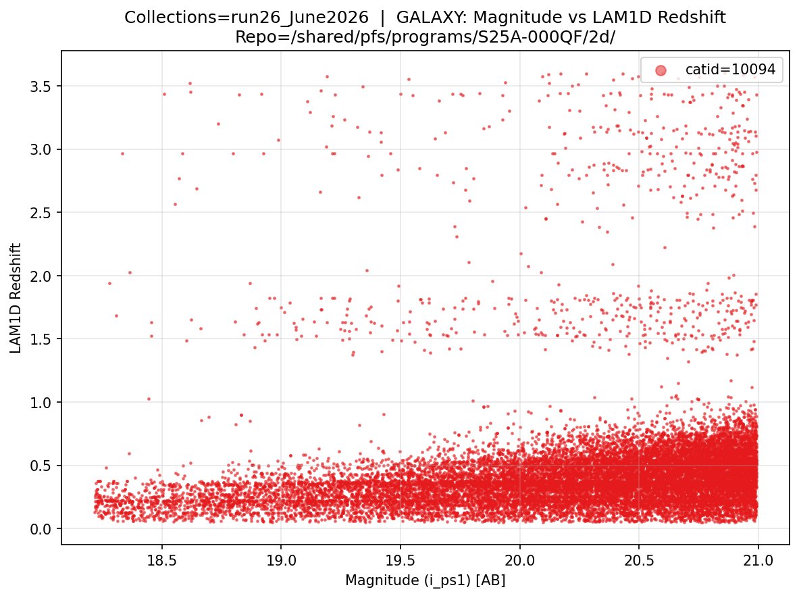
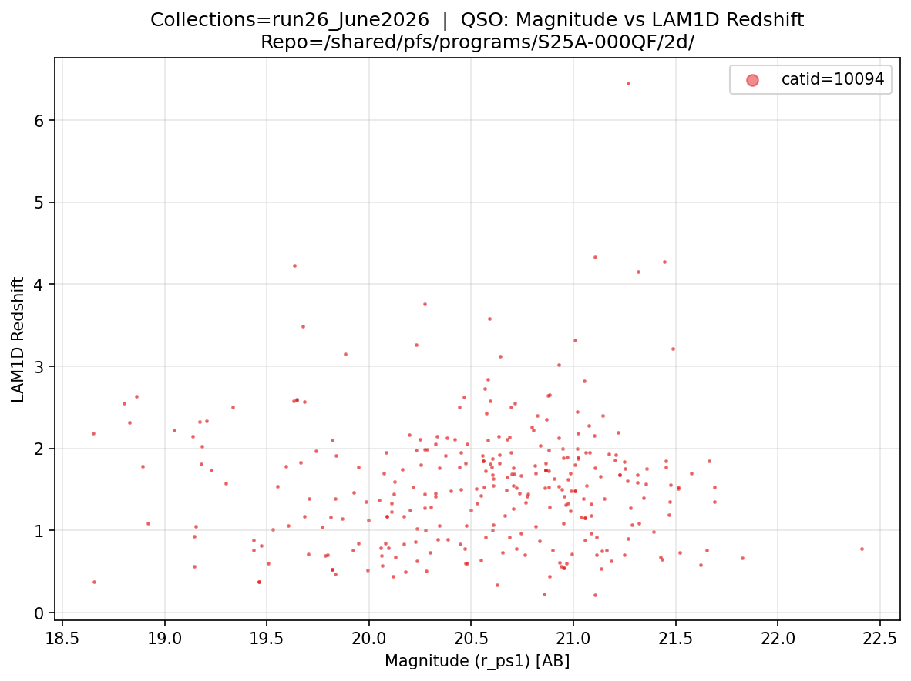
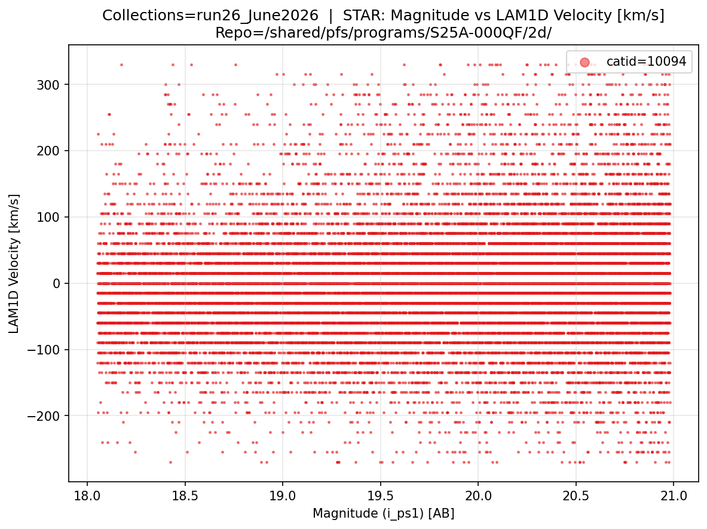

# pfsCoZCandidates

## Overview

`pfsCoZCandidates` is the LAM 1D output file. It bundles redshift candidates, classification results, line measurements, and quality flags for all objects in a single catalog (`catId`), following the same `pfsCoadd` structure.

The LAM 1D pipeline is run on each `pfsCoadd` file, i.e. one `pfsCoZCandidates` file is produced per `combination`/`catId`/`objGroup` combination (see the [pfsCoadd](03_16_pfscoadd.md) section). The files are stored inside the Butler repository and follow the same `combination` structure as `pfsCoadd`.

Filename format: `pfsCoZCandidates_PFS_{combination}_{catId}_{objGroup}_{collection}_{lam1d_collection}.fits`

Example from proposal `S25A-000QF`, catId 10094 (`brn_run26` combination, 22 object groups):

```
/shared/pfs/programs/S25A-000QF/2d/run26_June2026/lam1d_modified/pfsCoZCandidates/10094/
    pfsCoZCandidates_PFS_brn_run26_10094_1_run26_June2026_lam1d_modified.fits
    pfsCoZCandidates_PFS_brn_run26_10094_2_run26_June2026_lam1d_modified.fits
    ...
    pfsCoZCandidates_PFS_brn_run26_10094_22_run26_June2026_lam1d_modified.fits
```

- Flux units for line measurements are **nJy** (continuum) and **10⁻³⁵ W/m²** (line flux).
- For each object a GALAXY, QSO, and STAR template is fit, with the best indicated by the `class` column in the `CLASSIFICATION` HDU.
- Each object can have multiple redshift candidates; the best is indicated by `cRank=0` in the object `CANDIDATES` HDUs.

Filename format: `{path_to_pfsCoZCandidates}/{catId}_{objGroup}/data/pfsCoZcandidates-{catId}.fits`

**FITS structure:**


| HDU | Name                 | Type         | Description                                                      |
| --- | -------------------- | ------------ | ---------------------------------------------------------------- |
| #0  | PDU                  | Header       | Version keywords (D1D_VER, D1DP_VER, etc.)                       |
| #1  | TARGET               | Binary table | Object identifiers (targetId, catId, objId, ra, dec, targetType) |
| #2  | WARNINGS             | Binary table | Per-solver warning bitmasks                                      |
| #3  | ERRORS               | Binary table | Per-solver error codes and messages                              |
| #4  | CLASSIFICATION       | Binary table | Best classification (GALAXY/QSO/STAR) with probabilities         |
| #5  | GALAXY_CANDIDATES    | Binary table | Galaxy redshift candidates (ranked)                              |
| #6  | GALAXY_MODELS        | Image/table  | Best-fit galaxy model spectra (nJy)                              |
| #7  | GALAXY_REDSHIFT_GRID | Binary table | Redshift grid used for galaxy PDF                                |
| #8  | GALAXY_LN_PDF        | Image        | ln(probability) marginalised over galaxy templates               |
| #9  | GALAXY_LINES         | Binary table | Galaxy emission/absorption line measurements                     |
| #10 | QSO_CANDIDATES       | Binary table | QSO redshift candidates (ranked)                                 |
| #11 | QSO_MODELS           | Image/table  | Best-fit QSO model spectra (nJy)                                 |
| #12 | QSO_REDSHIFT_GRID    | Binary table | Redshift grid used for QSO PDF                                   |
| #13 | QSO_LN_PDF           | Image        | ln(probability) marginalised over QSO templates                  |
| #14 | QSO_LINES            | Binary table | QSO emission/absorption line measurements                        |
| #15 | STAR_CANDIDATES      | Binary table | Stellar radial velocity candidates (ranked)                      |
| #16 | STAR_MODELS          | Image/table  | Best-fit stellar model spectra (nJy)                             |
| #17 | STAR_VELOCITY_GRID   | Binary table | Velocity grid used for stellar PDF                               |
| #18 | STAR_LN_PDF          | Image        | ln(probability) marginalised over stellar templates              |
| #19 | QUALITY              | Binary table | Quality metrics (OII doublet SNR, valid pixel count, etc.)       |


## Key Columns

**CLASSIFICATION (HDU #4):**


| Column        | Type       | Description                                     |
| ------------- | ---------- | ----------------------------------------------- |
| `targetId`    | 16-bit INT | Links to TARGET HDU                             |
| `class`       | STRING     | Best classification: `GALAXY`, `QSO`, or `STAR` |
| `probaGalaxy` | FLOAT      | Probability of being a galaxy                   |
| `probaQSO`    | FLOAT      | Probability of being a QSO                      |
| `probaStar`   | FLOAT      | Probability of being a star                     |


**GALAXY_CANDIDATES (HDU #5) — key columns:**


| Column          | Type         | Description                  |
| --------------- | ------------ | ---------------------------- |
| `cRank`         | 32-bit INT   | Candidate rank; 0 = best     |
| `redshift`      | 32-bit FLOAT | Best-fit redshift            |
| `redshiftError` | 32-bit FLOAT | Redshift uncertainty         |
| `redshiftProba` | 32-bit FLOAT | PDF peak area (dz = ±3×10⁻³) |
| `subClass`      | STRING       | Sub-classification           |
| `continuumFile` | STRING       | Continuum template used      |


The same ranked-candidate structure applies to `QSO_CANDIDATES` (HDU #10) and `STAR_CANDIDATES` (HDU #15), with `velocity` replacing `redshift` for stars.

## Build LAM 1D Object Table & Plot Magnitude vs Redshift/Velocity

The following code builds a combined object table across all LAM 1D results in a `collection` with the best object classification and redshift/velocity values as indicated by the pipeline. It works in three steps:

1. **Magnitude lookup** — iterates over all visits in the `collection` via `pfsMerged`, extracting per-object magnitudes from `pfsConfig` across all available filters.
2. **LAM 1D FITS reading** — reads all `pfsCoZCandidates` FITS files for a given `collection`, extracting the best object classification, best redshift/velocity candidate (by highest probability), warnings, and errors for each object.
3. **Combining and saving** — merges the magnitude lookup with the LAM 1D results into a single CSV file (`{collections}_all_lam1d.csv`), which can be used to browse objects by class, redshift, velocity, or objId

After saving the CSV, the code plots **magnitude vs. redshift** (for GALAXY and QSO) and **magnitude vs. velocity** (for STAR), coloured by `catId`.

```python
import numpy as np
import pandas as pd
import matplotlib.pyplot as plt
from lsst.daf.butler import Butler
from pfs.datamodel import TargetType

# ==== USER-DEFINED PARAMETERS ====
repo              = "/shared/pfs/programs/S25A-000QF/2d/"
collections       = "run26_June2026"
collections_lam1d = "run26_June2026/lam1d_modified"  # LAM1D collection name

# ==== FIND OBJECT MAGNITUDES ====
butler     = Butler(repo, collections=[collections, collections_lam1d])
all_visits = sorted({ref.dataId['visit'] for ref in butler.registry.queryDatasets('pfsMerged')})
print(f"Building magnitude lookup from {len(all_visits)} visits...")

mag_lookup = {}
for i, visit in enumerate(all_visits):
    print(f"  Visit {i+1}/{len(all_visits)}: {visit}  ({len(mag_lookup)} unique objects so far)", end='\r', flush=True)
    pfsConfig = butler.get('pfsConfig', dict(visit=visit))
    sci       = pfsConfig.select(targetType=TargetType.SCIENCE, fiberStatus=1)
    if len(sci.objId) == 0:
        continue
    total_flux = np.array([list(f) for f in sci.totalFlux], dtype=float)
    psf_flux   = np.array([list(f) for f in sci.psfFlux],   dtype=float)
    flux       = np.where((total_flux > 0) & np.isfinite(total_flux), total_flux, psf_flux)
    with np.errstate(divide='ignore', invalid='ignore'):
        mags = np.where(flux > 0, -2.5 * np.log10(flux) + 31.4, np.nan)
    for j, oid in enumerate(sci.objId):
        oid_int = int(oid)
        if oid_int not in mag_lookup:
            obj_filters = list(sci.filterNames[j])
            seen, obj_cols = {}, []
            for fn in obj_filters:
                count = seen.get(fn, 0)
                obj_cols.append(f'mag_{fn}_{count}' if count > 0 or obj_filters.count(fn) > 1 else f'mag_{fn}')
                seen[fn] = count + 1
            mag_lookup[oid_int] = {col: mags[j, k] for k, col in enumerate(obj_cols)}

print()  # clear the \r line

mag_df       = pd.DataFrame([{'objId': oid, **m} for oid, m in mag_lookup.items()])
mag_cols_all = [col for col in mag_df.columns if col.startswith('mag_')]
empty_cols   = [col for col in mag_cols_all if mag_df[col].isna().all()]
mag_df       = mag_df.drop(columns=empty_cols)
mag_cols     = [col for col in mag_cols_all if col not in empty_cols]
print(f"Magnitude lookup complete: {len(mag_df)} unique objects  |  Filters: {mag_cols}")

# ==== READ LAM1D VIA BUTLER ====
refs = list(butler.registry.queryDatasets('pfsCoZCandidates'))
print(f"Reading LAM1D from {len(refs)} pfsCoZCandidates files via Butler...")

all_final_dfs = []
n_skipped     = 0

for i, ref in enumerate(refs):
    cat_id    = ref.dataId['cat_id']
    obj_group = ref.dataId['obj_group']
    print(f"  Processing file {i+1}/{len(refs)}  ({n_skipped} skipped)", end='\r', flush=True)
    try:
        coZCands = butler.get('pfsCoZCandidates', ref.dataId)
    except Exception as e:
        print(f"\n  Failed cat_id={cat_id} obj_group={obj_group}: {e}")
        n_skipped += 1
        continue

    records = []
    for target in coZCands:
        zc  = coZCands[target]
        nan = float('nan')
        rec = {
            'objId':       int(target.objId),
            'catid':       cat_id,
            'obj_group':   obj_group,
            'combination': ref.dataId['combination'],
            'class':       zc.classification.name,
            'probaGalaxy': next((float(v) for k, v in zc.classification.probabilities.items() if k.upper() == 'GALAXY'), nan),
            'probaQSO':    next((float(v) for k, v in zc.classification.probabilities.items() if k.upper() == 'QSO'),    nan),
            'probaStar':   next((float(v) for k, v in zc.classification.probabilities.items() if k.upper() == 'STAR'),   nan),
        }
        try:
            gp = zc.galaxy.parameters[0]
            rec['redshift_gal']      = gp.get('redshift',      nan)
            rec['redshiftProba_gal'] = gp.get('redshiftProba', nan)
        except (IndexError, AttributeError, TypeError):
            rec['redshift_gal'] = rec['redshiftProba_gal'] = nan
        try:
            qp = zc.qso.parameters[0]
            rec['redshift_qso']      = qp.get('redshift',      nan)
            rec['redshiftProba_qso'] = qp.get('redshiftProba', nan)
        except (IndexError, AttributeError, TypeError):
            rec['redshift_qso'] = rec['redshiftProba_qso'] = nan
        try:
            sp = zc.star.parameters[0]
            rec['velocity_star']      = sp.get('velocity',      nan)
            rec['templateProba_star'] = sp.get('templateProba', nan)
        except (IndexError, AttributeError, TypeError):
            rec['velocity_star'] = rec['templateProba_star'] = nan
        records.append(rec)

    if records:
        all_final_dfs.append(pd.DataFrame(records))

if not all_final_dfs:
    raise ValueError("No data found — check collections and lam1d collection name.")

print()  # clear the \r line
print(f"Processed {len(all_final_dfs)} files  ({n_skipped} skipped)")

# ==== COMBINE AND ATTACH MAGNITUDES ====
combined_df = pd.concat(all_final_dfs, ignore_index=True)
combined_df = combined_df.merge(mag_df[['objId'] + mag_cols], on='objId', how='left')
matched     = combined_df[mag_cols].notna().any(axis=1).sum()
print(f"Magnitudes matched: {matched} / {len(combined_df)} objects")

# ==== AUTO-CORRECT VELOCITY UNITS IF NEEDED ====
# The datamodel specifies km/s, but older releases used m/s. If the median absolute
# stellar velocity is >> 500 km/s, it is almost certainly stored in m/s and is corrected.
star_mask = combined_df['class'].str.upper() == 'STAR'
if star_mask.any():
    median_vel = combined_df.loc[star_mask, 'velocity_star'].abs().median()
    if median_vel > 5000:
        print(f"Auto-correcting velocity units: median |velocity|={median_vel:.0f} → likely m/s, dividing by 1000")
        combined_df.loc[star_mask, 'velocity_star'] = combined_df.loc[star_mask, 'velocity_star'] / 1000

# ==== SAVE ====
combined_df.to_csv(f'{collections}_all_lam1d.csv', index=False)
print(f"Saved {collections}_all_lam1d.csv  ({len(combined_df)} objects)")

# ==== CLASS BREAKDOWN ====
print("\nClass breakdown:")
for cls in sorted(combined_df['class'].str.upper().unique()):
    n = (combined_df['class'].str.upper() == cls).sum()
    print(f"  {cls}: {n} objects")

# ==== PLOTS: MAG VS REDSHIFT / VELOCITY PER CLASS ====
plot_config = [
    ("GALAXY", "redshift_gal",  "LAM1D Redshift",        1),
    ("QSO",    "redshift_qso",  "LAM1D Redshift",        1),
    ("STAR",   "velocity_star", "LAM1D Velocity [km/s]", 1),
]

unique_catids = sorted(combined_df['catid'].unique())
colors        = plt.cm.Set1(np.linspace(0, 1, max(len(unique_catids), 3)))
catid_colors  = dict(zip(unique_catids, colors))

for class_name, y_col, y_label, y_scale in plot_config:
    df_cls = combined_df[combined_df['class'].str.upper() == class_name].copy()
    if df_cls.empty:
        print(f"No {class_name} objects, skipping plot.")
        continue

    best_mag_col = df_cls[mag_cols].notna().sum().idxmax()
    filter_label = best_mag_col.replace('mag_', '')

    mag_vals = df_cls[best_mag_col]
    y_vals   = df_cls[y_col] * y_scale
    mag_lo, mag_hi = np.nanpercentile(mag_vals.dropna(), [1, 99])
    y_lo,   y_hi   = np.nanpercentile(y_vals.dropna(),   [1, 99])
    plot_mask = (
        mag_vals.between(mag_lo, mag_hi) &
        y_vals.between(y_lo, y_hi)
    )
    df_plot = df_cls[plot_mask]

    plt.figure(figsize=(8, 6))
    for cid in unique_catids:
        df_cid = df_plot[df_plot['catid'] == cid]
        if df_cid.empty:
            continue
        plt.scatter(df_cid[best_mag_col], df_cid[y_col] * y_scale, s=2, alpha=0.5,
                    color=catid_colors[cid], label=f'catid={cid}')

    plt.xlabel(f'Magnitude ({filter_label}) [AB]')
    plt.ylabel(y_label)
    plt.title(f'Collections={collections}  |  {class_name}: Magnitude vs {y_label}\nRepo={repo}')
    plt.legend(loc='upper right', markerscale=5)
    plt.grid(True, alpha=0.3)
    plt.tight_layout()
    plt.savefig(f'{collections}_{class_name}_mag_vs_{y_col}.png', dpi=150, bbox_inches='tight')
    plt.show()
```


**Output**:

```
Building magnitude lookup from 426 visits...
  Visit 426/426: 139726  (42558 unique objects so far)
Magnitude lookup complete: 42558 unique objects  |  Filters: ['mag_g_ps1', 'mag_r_ps1', 'mag_i_ps1', 'mag_z_ps1', 'mag_y_ps1']

Reading LAM1D from 32 pfsCoZCandidates files via Butler...
  Processing file 32/32  (0 skipped)
Processed 32 files  (0 skipped)

Magnitudes matched: 44333 / 44333 objects
Saved run26_June2026_all_lam1d.csv  (44333 objects)

Class breakdown:
  GALAXY: 20044 objects
  QSO: 309 objects
  STAR: 23980 objects
```






