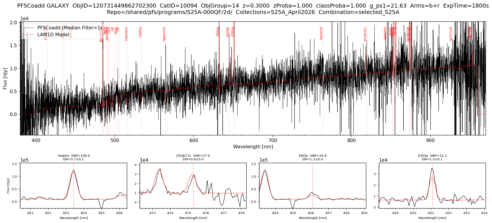

# pfsCoadd Spectrum + LAM 1D Model

The following code plots the `pfsCoadd` spectrum of a single object overlaid with the LAM 1D best-fit model, and marks detected spectral lines. It requires the `{collections}_all_lam1d.csv` file produced by the object table code in the [pfsCoZCandidates](04_12_lam1d_zcandidates.md) section — run that code once before using this plotter.

The code supports three modes of object selection:

- **By `objid`** — plots that object directly, auto-detecting its class from the CSV.
- **By class + redshift/velocity** — finds the object in the CSV closest to a target redshift (GALAXY/QSO) or velocity (STAR) provided.
- **By class + `browse_index`** — steps through all objects of a given class sorted by descending redshift/velocity.

Once an object is loaded, the code fetches the `pfsCoadd` spectrum via `Butler` and reads the corresponding LAM 1D FITS file directly from disk. The main plot shows the observed spectrum (black) and the LAM 1D model fit (red) with detected line positions marked. For GALAXY and QSO objects, up to four zoom panels below the main plot show the top-ranked lines by SNR, with the line name, SNR, and equivalent width displayed. A summary table of the top 10 lines by SNR is also printed to the terminal.

```python
# ==== PFSCOADD + LAM1D SPECTRA ====

import numpy as np
import pandas as pd
import matplotlib.pyplot as plt
from scipy import ndimage
from lsst.daf.butler import Butler

# ==== USER-DEFINED PARAMETERS ====
repo        = "/shared/pfs/programs/S25A-000QF/2d/"
collections = "S25A_April2026"
combination = "selected_S25A"

# CLASS PARAMETERS
# Note: Set to None if you do not want to use a particular parameter
class_name           = None       # 'GALAXY', 'QSO' or 'STAR'
browse_index         = None       # 0 = highest redshift/velocity, increment to browse
search_redshift      = None       # GALAXY/QSO: find closest object to this redshift, overrides browse_index
search_velocity_kms  = None       # STAR: find closest object to this velocity [km/s], overrides browse_index
objid                = 120731449862702300  # if set, overrides everything else and plots target spectrum directly

# PLOT PARAMETERS
MEDIAN_FILTER_SIZE   = 1          # 1 = no filtering, increment for smoothing as desired
arms                 = ['b', 'r'] # options: 'b', 'r', 'n' or any combination of arms to plot

# ==== HELPERS ====
# _get_zinfo: extracts class, redshift/velocity, redshift probability, and class probability
#             directly from a zCand object via Butler
# _get_mag:   looks up the best available magnitude from pfsConfig for a given objId
#             using a visit from the pfsCoadd observations list
def _get_zinfo(zCand):
    cname   = zCand.classification.name
    z_key   = {"STAR": "velocity", "GALAXY": "redshift", "QSO": "redshift"}[cname]
    params  = zCand.get_classified_parameters()
    z_val   = float(params[z_key])
    z_proba = float(params.get('templateProba' if cname == 'STAR' else 'redshiftProba', float('nan')))
    c_proba = next((float(v) for k, v in zCand.classification.probabilities.items() if k.upper() == cname), float('nan'))
    return cname, z_val, z_proba, c_proba

def _get_mag(butler, objid, visits):
    for visit in visits:
        pfsConf = butler.get('pfsConfig', visit=int(visit))
        idx = np.where(pfsConf.objId == np.int64(objid))[0]
        if len(idx) == 0:
            continue
        i       = idx[0]
        filters = list(pfsConf.filterNames[i])
        total   = np.array(list(pfsConf.totalFlux[i]), dtype=float)
        psf     = np.array(list(pfsConf.psfFlux[i]),   dtype=float)
        flux    = np.where((total > 0) & np.isfinite(total), total, psf)
        mags    = np.where(flux > 0, -2.5 * np.log10(flux) + 31.4, np.nan)
        j       = next((k for k, m in enumerate(mags) if np.isfinite(m)), None)
        return f"{filters[j]}={mags[j]:.2f}" if j is not None else "mag=N/A"
    return "mag=N/A"

# ==== PFSCOADD+LAM1D PLOTTING FUNCTION ====
def plot_pfscoadd_lam1d(
    repo, collections, combination,
    class_name, browse_index, search_redshift, search_velocity_kms, objid,
    MEDIAN_FILTER_SIZE, arms,
):
    ARM_RANGES = {
        'b': (380,  650),
        'r': (630,  970),
        'n': (940, 1260),
    }

    butler  = Butler(repo, collections=[collections, f"{collections}/lam1d_modified"])
    cat_ids = sorted(set(ref.dataId['cat_id'] for ref in butler.registry.queryDatasets('pfsCoadd')))
    mag_str = None

    # ==== FIND OBJECT SPECIFICS ====
    if objid is not None:
        # Fast path: use objectGroupMap + Butler directly, no CSV needed
        objid = int(objid)
        for cat_id in cat_ids:
            ogm = butler.get("objectGroupMap", combination=combination, cat_id=cat_id)
            try:
                obj_group = ogm[objid]
                break
            except KeyError:
                continue
        else:
            raise ValueError(f"objId {objid} not found in any objectGroupMap")
        coZCands                                     = butler.get('pfsCoZCandidates', combination=combination, cat_id=cat_id, obj_group=obj_group)
        zCand                                        = coZCands[objid]
        class_name, redshift_value, z_proba, c_proba = _get_zinfo(zCand)
        z_proba_str     = f"{z_proba:.3f}"  if np.isfinite(z_proba)  else "N/A"
        class_proba_str = f"{c_proba:.3f}"  if np.isfinite(c_proba)  else "N/A"
        print(f"Auto-detected class: {class_name} for objId={objid}")

    elif search_redshift is not None or search_velocity_kms is not None:
        # CSV path: fast browse via pre-built table
        df          = pd.read_csv(f"{collections}_all_lam1d.csv")
        df['objId'] = df['objId'].astype(np.int64)
        df          = df[df['combination'] == combination]
        df          = df[df['class'].str.upper() == class_name.upper()].reset_index(drop=True)
        redshift_column = {"GALAXY": "redshift_gal", "QSO": "redshift_qso", "STAR": "velocity_star"}[class_name.upper()]
        if class_name.upper() == "STAR":
            if search_velocity_kms is None:
                raise ValueError("class_name is STAR but search_velocity_kms is not set")
            target_val = search_velocity_kms
            label_str  = f"velocity={search_velocity_kms} km/s"
        else:
            if search_redshift is None:
                raise ValueError(f"class_name is {class_name} but search_redshift is not set")
            target_val = search_redshift
            label_str  = f"z={search_redshift}"
        closest_idx    = (df[redshift_column] - target_val).abs().idxmin()
        row            = df.loc[closest_idx]
        objid          = int(row['objId'])
        cat_id         = int(row['catid'])
        obj_group      = int(row['obj_group'])
        redshift_value = row[redshift_column]
        found_val      = redshift_value if class_name.upper() == "STAR" else redshift_value
        found_unit     = "km/s" if class_name.upper() == "STAR" else ""
        print(f"Target {label_str} → closest object at {redshift_column}={found_val:.1f} {found_unit}  (idx={closest_idx})")
        z_proba_col     = {"GALAXY": "redshiftProba_gal", "QSO": "redshiftProba_qso", "STAR": "templateProba_star"}[class_name.upper()]
        c_proba_col     = {"GALAXY": "probaGalaxy",       "QSO": "probaQSO",          "STAR": "probaStar"}[class_name.upper()]
        z_proba_str     = f"{row[z_proba_col]:.3f}" if z_proba_col in row.index and pd.notna(row[z_proba_col]) else "N/A"
        class_proba_str = f"{row[c_proba_col]:.3f}" if c_proba_col in row.index and pd.notna(row[c_proba_col]) else "N/A"
        mag_cols        = [c for c in row.index if c.startswith('mag_')]
        best_mag_col    = next((c for c in mag_cols if pd.notna(row[c])), None)
        mag_str         = f"{best_mag_col.replace('mag_', '')}={row[best_mag_col]:.2f}" if best_mag_col else "mag=N/A"
        coZCands        = butler.get('pfsCoZCandidates', combination=combination, cat_id=cat_id, obj_group=obj_group)
        zCand           = coZCands[objid]

    else:
        # CSV path: fast browse via pre-built table
        df          = pd.read_csv(f"{collections}_all_lam1d.csv")
        df['objId'] = df['objId'].astype(np.int64)
        df          = df[df['combination'] == combination]
        df          = df[df['class'].str.upper() == class_name.upper()].reset_index(drop=True)
        redshift_column = {"GALAXY": "redshift_gal", "QSO": "redshift_qso", "STAR": "velocity_star"}[class_name.upper()]
        df_sorted       = df.sort_values(redshift_column, ascending=False).reset_index(drop=True)
        print(f"Loaded {len(df_sorted)} {class_name} objects from {collections}_all_lam1d.csv")
        print(f"Sorted by {redshift_column} descending  |  Showing index {browse_index} of {len(df_sorted)-1}")
        row            = df_sorted.iloc[browse_index]
        objid          = int(row['objId'])
        cat_id         = int(row['catid'])
        obj_group      = int(row['obj_group'])
        redshift_value = row[redshift_column]
        z_proba_col     = {"GALAXY": "redshiftProba_gal", "QSO": "redshiftProba_qso", "STAR": "templateProba_star"}[class_name.upper()]
        c_proba_col     = {"GALAXY": "probaGalaxy",       "QSO": "probaQSO",          "STAR": "probaStar"}[class_name.upper()]
        z_proba_str     = f"{row[z_proba_col]:.3f}" if z_proba_col in row.index and pd.notna(row[z_proba_col]) else "N/A"
        class_proba_str = f"{row[c_proba_col]:.3f}" if c_proba_col in row.index and pd.notna(row[c_proba_col]) else "N/A"
        mag_cols        = [c for c in row.index if c.startswith('mag_')]
        best_mag_col    = next((c for c in mag_cols if pd.notna(row[c])), None)
        mag_str         = f"{best_mag_col.replace('mag_', '')}={row[best_mag_col]:.2f}" if best_mag_col else "mag=N/A"
        coZCands        = butler.get('pfsCoZCandidates', combination=combination, cat_id=cat_id, obj_group=obj_group)
        zCand           = coZCands[objid]

    # ==== SHARED LABELS ====
    redshift_label = f"velocity={redshift_value:.1f} km/s" if class_name.upper() == "STAR" else f"z={redshift_value:.4f}"

    # ==== LOAD pfsCoadd ====
    print(f"Loading pfsCoadd for catid={cat_id} obj_group={obj_group}...")
    pfscoadd  = butler.get("pfsCoadd", combination=combination, cat_id=cat_id,
                           instrument='PFS', obj_group=obj_group)
    pfsobject = pfscoadd[int(objid)]

    # ==== EXPOSURE TIME ====
    unique_visits, idx = np.unique(pfsobject.observations.visit, return_index=True)
    total_exptime      = pfsobject.observations.expTime[idx].sum()

    # ==== MAGNITUDE (objid path: look up from pfsConfig; browse/search: already set from CSV) ====
    if mag_str is None:
        mag_str = _get_mag(butler, objid, unique_visits)

    print(f"ObjId={objid}  CatID={cat_id}  ObjGroup={obj_group}  {redshift_label}  {mag_str}  zProba={z_proba_str}  classProba={class_proba_str}")

    # ==== LOAD LAM1D MODEL AND SPECTRAL LINES ====
    top4 = None
    if class_name.upper() == "STAR":
        print("STAR object — LAM1D model fit uses stellar templates (no emission lines)")
        model      = zCand.get_classified_model()
        line_names = []
        line_waves = []
    else:
        model = zCand.get_classified_model()
        lines = zCand.qso.lines if class_name.upper() == "QSO" else zCand.galaxy.lines
        if lines is not None:
            line_names      = lines['lineName'].tolist()
            line_waves      = lines['lineWave'].tolist()
            lines_df        = lines.to_pandas()
            lines_df['SNR'] = lines_df['lineFlux'] / lines_df['lineFluxError']
            top10           = lines_df.nlargest(10, 'SNR')
            top4            = top10.head(4)
            print(f"\n---- Top 10 Lines by SNR  (global z={redshift_value:.4f}) ----")
            print(f"  {'Line':<12}  {'SNR':>6}  {'EW':>8}  {'EW_err':>8}  {'lineZ':>7}  {'dz':>7}  {'sigma':>6}")
            print(f"  {'----':<12}  {'---':>6}  {'--':>8}  {'------':>8}  {'-----':>7}  {'--':>7}  {'-----':>6}")
            for _, r in top10.iterrows():
                dz = r['lineZ'] - redshift_value
                print(f"  {r['lineName']:<12}  {r['SNR']:>6.1f}  {r['lineEW']:>8.1f}  {r['lineEWError']:>8.1f}  {r['lineZ']:>7.4f}  {dz:>+7.4f}  {r['lineSigma']:>6.2f}")
            print()
        else:
            line_names = []
            line_waves = []
            print("No lines table available.\n")

    # ==== ARM MASK ====
    arm_mask = np.zeros(len(pfsobject.wavelength), dtype=bool)
    for arm in arms:
        lo, hi = ARM_RANGES[arm]
        arm_mask |= (pfsobject.wavelength >= lo) & (pfsobject.wavelength <= hi)

    xlim_lo = min(ARM_RANGES[arm][0] for arm in arms)
    xlim_hi = max(ARM_RANGES[arm][1] for arm in arms)

    # ==== MASK BAD PIXELS ====
    pixels_bad  = (pfsobject.mask & pfsobject.flags.get('BAD', 'CR', 'SAT', 'NO_DATA')) != 0
    pixels_good = arm_mask & ~pixels_bad

    # ==== YLIM ====
    flux_in_range = pfsobject.flux[pixels_good]
    p2, p98       = np.nanpercentile(flux_in_range, [2, 98])
    span          = p98 - p2
    ylim_lower    = p2  - 0.05 * span
    ylim_upper    = p98 + 0.15 * span

    # ==== PLOT ====
    has_zoom = top4 is not None and len(top4) > 0
    n_zoom   = len(top4) if has_zoom else 0

    if has_zoom:
        fig = plt.figure(figsize=(15, 7))
        gs  = fig.add_gridspec(2, 4, height_ratios=[2.5, 1],
                               top=0.88, bottom=0.08, left=0.05, right=0.98,
                               hspace=0.35, wspace=0.12)
        ax_main = fig.add_subplot(gs[0, :])
    else:
        fig, ax_main = plt.subplots(figsize=(12, 5))
        fig.subplots_adjust(top=0.88, bottom=0.1, left=0.07, right=0.97)

    ax_main.plot(pfsobject.wavelength[pixels_good],
                 ndimage.median_filter(pfsobject.flux[pixels_good], size=MEDIAN_FILTER_SIZE),
                 linewidth=0.5, color='black', label=f'PFSCoadd (Median Filter={MEDIAN_FILTER_SIZE})')
    ax_main.plot(pfsobject.wavelength[arm_mask],
                 ndimage.median_filter(model[arm_mask], size=MEDIAN_FILTER_SIZE),
                 linewidth=0.5, color='red',
                 label='LAM1D Stellar Template' if class_name.upper() == "STAR" else 'LAM1D Model',
                 alpha=0.7)
    ax_main.set_xlim([xlim_lo, xlim_hi])
    ax_main.set_ylim([ylim_lower, ylim_upper])
    ax_main.ticklabel_format(axis='y', style='sci', scilimits=(0, 0))

    # ==== EMISSION LINE MARKERS ====
    x_lo, x_hi = ax_main.get_xlim()
    y_top       = ax_main.get_ylim()[1]
    for lw, ln in zip(line_waves, line_names):
        if not (x_lo <= lw <= x_hi):
            continue
        ax_main.axvline(x=lw, color='red', linestyle='--', alpha=0.3, linewidth=0.5)
        ax_main.text(lw, y_top * 0.95, ln, rotation=90,
                     verticalalignment='top', horizontalalignment='right',
                     fontsize=7, color='red')

    arms_label = '+'.join(arms)
    ax_main.set_title(f'PFSCoadd {class_name}  ObjID={objid}  CatID={cat_id}  ObjGroup={obj_group}  {redshift_label}  zProba={z_proba_str}  classProba={class_proba_str}  {mag_str}  Arms={arms_label}  ExpTime={total_exptime:.0f}s\n'
                      f'Repo={repo}  Collections={collections}  Combination={combination}')
    ax_main.legend(loc='upper left', fancybox=True, framealpha=0.5)
    ax_main.minorticks_on()
    ax_main.set_xlabel('Wavelength [nm]')
    ax_main.set_ylabel('Flux [nJy]')

    # ==== ZOOM SUBPLOTS ====
    if has_zoom:
        for i in range(4):
            ax = fig.add_subplot(gs[1, i])
            if i < n_zoom:
                r      = top4.iloc[i]
                lw_ctr = r['lineWave']
                if class_name.upper() == "QSO":
                    hw = np.clip(round(r['lineSigma'] * 12), 6, 80)
                else:
                    hw = np.clip(round(r['lineSigma'] * 6), 3, 40)
                w_lo   = lw_ctr - hw
                w_hi   = lw_ctr + hw
                zmask  = pixels_good & (pfsobject.wavelength >= w_lo) & (pfsobject.wavelength <= w_hi)
                zarm   = (pfsobject.wavelength >= w_lo) & (pfsobject.wavelength <= w_hi)
                if zmask.sum() > 0:
                    ax.plot(pfsobject.wavelength[zmask],
                            ndimage.median_filter(pfsobject.flux[zmask], size=MEDIAN_FILTER_SIZE),
                            linewidth=0.8, color='black')
                    ax.plot(pfsobject.wavelength[zarm],
                            ndimage.median_filter(model[zarm], size=MEDIAN_FILTER_SIZE),
                            linewidth=0.8, color='red', alpha=0.7)
                    zp2, zp98 = np.nanpercentile(pfsobject.flux[zmask], [2, 98])
                    zspan     = zp98 - zp2
                    ax.set_ylim([zp2 - 0.1 * zspan, zp98 + 0.3 * zspan])
                ax.axvline(x=lw_ctr, color='red', linestyle='--', alpha=0.5, linewidth=0.8)
                ax.set_xlim([w_lo, w_hi])
                ax.set_title(f"{r['lineName']}  SNR={r['SNR']:.1f}\nEW={r['lineEW']:.1f}±{r['lineEWError']:.1f}", fontsize=7)
                ax.set_xlabel('Wavelength [nm]', fontsize=7)
                ax.tick_params(labelsize=7)
                ax.ticklabel_format(axis='y', style='sci', scilimits=(0, 0))
                ax.minorticks_on()
                if i == 0:
                    ax.set_ylabel('Flux [nJy]', fontsize=7)
            else:
                ax.set_visible(False)

    fig.savefig(f'{collections}_{class_name}_{objid}.png', dpi=150, bbox_inches='tight')
    plt.show()

# ==== RUN ====
plot_pfscoadd_lam1d(
    repo                = repo,
    collections         = collections,
    combination         = combination,
    class_name          = class_name,
    browse_index        = browse_index,
    search_redshift     = search_redshift,
    search_velocity_kms = search_velocity_kms,
    objid               = objid,
    MEDIAN_FILTER_SIZE  = MEDIAN_FILTER_SIZE,
    arms                = arms,
)
```

**Output**:
```
Target z=0.3 → closest object at redshift_gal=0.3000   (idx=2829)
ObjId=120731449862702300  CatID=10094  ObjGroup=14  redshift_gal=0.3000  g_ps1=21.63  zProba=1.000  classProba=1.000
Loading pfsCoadd and LAM1D for catid=10094 obj_group=14...

---- Top 10 Lines by SNR  (global z=0.3000) ----
  Line             SNR        EW    EW_err    lineZ       dz   sigma
  ----             ---        --    ------    -----       --   -----
  Halpha         108.9       5.7       0.1   0.3000  +0.0000    0.19
  [SII]6731       37.9       0.8       0.0   0.3000  +0.0000    0.18
  [NII]a          34.8       1.2       0.0   0.3000  +0.0000    0.19
  [OIII]a         31.2       1.5       0.1   0.3000  -0.0000    0.14
  [OII]3726       26.8       2.2       0.2   0.3000  +0.0000    0.12
  [SII]6716       26.6       1.0       0.0   0.3000  +0.0000    0.18
  [OII]3729       25.4       3.5       0.2   0.3000  +0.0000    0.12
  [OIII]b         16.3       0.5       0.0   0.3000  -0.0000    0.14
  Hbeta           16.1       1.3       0.1   0.3000  -0.0000    0.13
  [NII]b          10.3       0.4       0.0   0.3000  +0.0000    0.19
```


